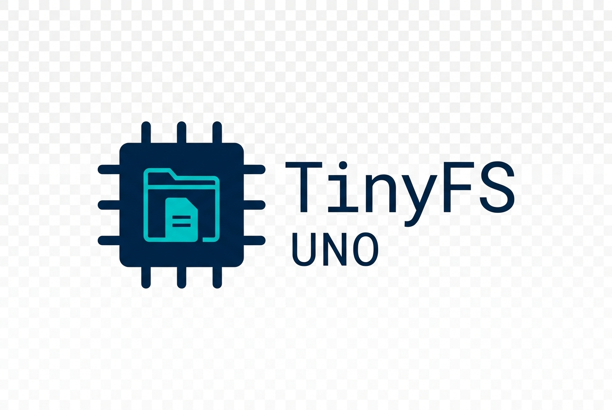

<p align="center">
  
</p>

<h1 align="center">TinyFS-UNO</h1>

<p align="center">
  <em>A crash-consistent, wear-aware, integrity-checked log-structured filesystem for the Arduino Uno's internal 1 KB EEPROM.</em>
</p>

<p align="center">
  <a href="LICENSE"></a>
  
  
  
  
  <a href="https://github.com/VinayakGhai/TinyFS-UNO/issues"></a>
  <a href="https://github.com/VinayakGhai/TinyFS-UNO/stargazers"></a>
</p>

<p align="center">
  <strong>
    <a href="#5-serial-cli-console-commands">CLI Commands</a> · 
    <a href="docs/00_OVERVIEW.md">Documentation</a> · 
    <a href="#6-host-side-testing--fault-injection">Testing</a> · 
    <a href="CONTRIBUTING.md">Contributing</a>
  </strong>
</p>

---

### ✨ Highlights

| | |
|---|---|
| 🔒 **Crash-Safe** | Trailing commit markers + CRC-16 — partial writes roll back automatically on reboot |
| ⚡ **20 Bytes SRAM** | Filesystem context fits in 20 bytes; filenames are compared directly on EEPROM |
| 🔁 **Wear-Leveling** | Log-structured append + ping-pong sector compaction distributes writes evenly |
| 🧪 **12 Host Tests** | Fault injection at every byte boundary verifies power-loss recovery |
| 🛡️ **Dual Superblocks** | Redundant metadata protects against write failures during sector switches |
| 🖥️ **Interactive CLI** | Full serial console — `ls`, `cat`, `write`, `rm`, `check`, `health`, `benchmark` |

> [!WARNING]
> This project is an experimental/educational filesystem and should not be trusted with important data.

---

## 1. Project Motivation
The primary engineering challenge of this project is:
*How much filesystem reliability and functionality can be achieved when the persistent storage is only 1024 bytes and the device has only 2 KB of SRAM?*

TinyFS-UNO answers this by implementing key concepts from modern flash filesystems (like littlefs and LFS) scaled down to run on raw, ultra-constrained 8-bit microcontrollers.

---

## 2. Architecture Diagram

```
                    TinyFS API (write, read, delete, ls)
                      │
                      ▼
              Storage Abstraction Layer (Metrics telemetry)
                      │
                      ▼
                EEPROM Backend
                      │
              ┌───────┴───────┐
              │               │
          Sector A         Sector B
          (0x020-0x20F)    (0x210-0x3FF)
              │               │
              └──────┬────────┘
                     │
              Append-only records
                     │
        ┌────────────┼────────────┐
        ▼            ▼            ▼
      CRCs       Commit       Metadata
      (CRC-16)   Marker (0x55) (RecordHeader)
                     │
                     ▼
               Recovery Engine (tfs_mount)
                     │
                     ▼
              Garbage Collector (tfs_gc_compact)
```

---

## 3. EEPROM Symmetrical Layout

The 1024 bytes of the internal EEPROM are mapped as follows:

```
Address
0x000 ┌───────────────────┐
      │ Superblock 1 (16B)│  ← Monotonic Generation (SB1)
0x010 ├───────────────────┤
      │ Superblock 2 (16B)│  ← Monotonic Generation (SB2)
0x020 ├───────────────────┤
      │ Sector A (496B)   │  ← Header (8B) + Sequential Log (488B)
      │                   │
0x210 ├───────────────────┤
      │ Sector B (496B)   │  ← Header (8B) + Sequential Log (488B)
      │                   │
0x400 └───────────────────┘
```

* **Superblock Size:** 16 bytes.
* **Sector Header Size:** 8 bytes (stores state: `EMPTY` `0xFF`, `BUILDING` `0x7F`, `VALID` `0x00`).
* **Active Record Overhead:** 19 bytes per file.
* **Maximum File Payload (`TFS_MAX_PAYLOAD`):** 256 bytes.

---

## 4. Key Features

1. **Ultra-Low Memory Footprint:** Uses **only 20 bytes of SRAM** at runtime by scanning filenames directly from the media.
2. **Ping-Pong Sectoring:** Alternates active sectors. Garbage collection copies active files to the inactive sector and switches sectors atomically.
3. **Double Superblocks:** A redundant pair of superblocks protects against write failure during sector swapping.
4. **Single-Pass Atomic Writes:** Incorporates a trailing commit marker (`0x55`) and CRC-16 checks. If power is lost, the file naturally rolls back on next boot.
5. **Redundancy Repair:** `repair` recovers corrupt superblocks or stuck building states using double metadata checks.
6. **Telemetry & Wear Monitoring:** Tracks logical/physical write amplification and estimates cell-level wear distribution.

---

## 5. Serial CLI Console Commands

Connect the Arduino Uno via USB, open the Serial Monitor at 9600 baud, and interact with:

* `ls`: Lists all files, sizes, and EEPROM addresses.
* `write <filename> "<content>"`: Writes or updates a file.
* `cat <filename>`: Prints file content (read in 32-byte chunks).
* `rm <filename>`: Atomically appends a delete record.
* `stat <filename>`: Shows file status, size, physical address, and status.
* `statfs`: Displays filesystem storage metrics and compaction margins.
* `check`: Evaluates the integrity of superblocks, sector headers, and record chains.
* `repair`: Corrects detected corruptions (restoring superblock redundancy).
* `health`: Displays session metrics, write amplification, and cell wear.
* `benchmark`: Executes a self-performance benchmark.
* `reboot`: Reloads/remounts the filesystem.

---

## 6. Host-Side Testing & Fault-Injection

The core filesystem is 100% portable. You can compile and run tests on the Host Linux PC:

```bash
cd tests
make run
```

### Fault-Injection Suite
The host test suite features a deterministic write-interruption mechanism. It executes loops that limit raw writes byte-by-byte to verify that:
1. Every partial file write is safely ignored.
2. Interrupted compaction leaves the source sector intact.
3. Recovery always rolls back cleanly to the last valid state.

---

## 7. Comparative Metrics

| Feature | TinyFS-UNO | littlefs | OSFS |
|---|---|---|---|
| **Target Storage** | 1 KB EEPROM | SPI Flash | EEPROM |
| **RAM Overhead** | 20 bytes | ~1.5 - 2 KB | ~100 bytes |
| **Flash size** | ~4 KB | ~12 - 20 KB | ~3 KB |
| **Wear Leveling** | Yes (Log-Structured)| Yes (Block-based) | No |
| **Power-Loss Safe**| Yes (Commit markers) | Yes (COW) | No |
| **CRC checking** | Yes (CRC-8 & CRC-16)| Yes (CRC-32) | No |

---

## 8. License
This project is licensed under the MIT License - see the [LICENSE](LICENSE) file for details.
